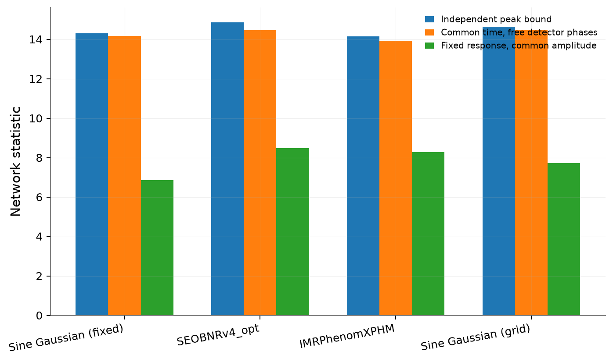
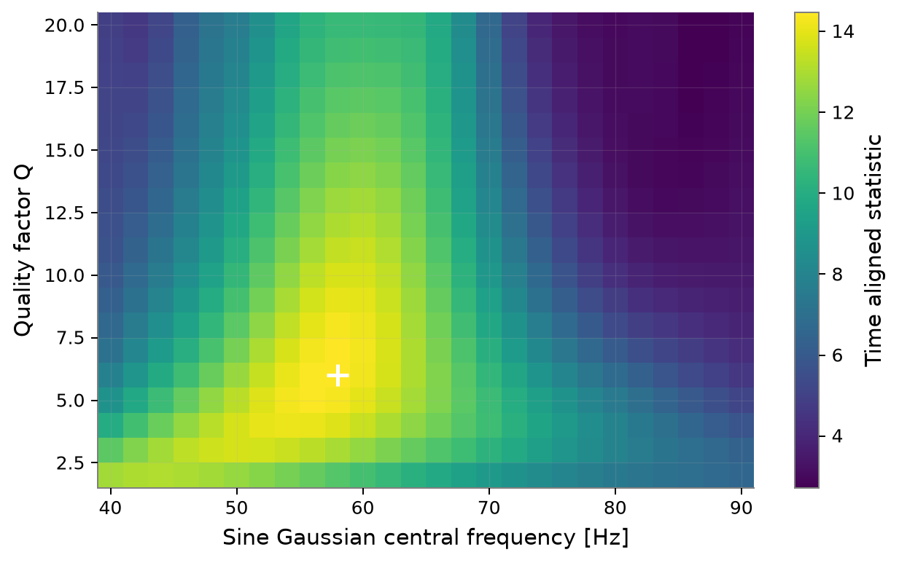

# Revisiting GW190521 with open data

**Waveform timing, noise weighting and network consistency**

A reproducible study of public LIGO Hanford, LIGO Livingston and Virgo strain for
GW190521. It compares compact binary templates with sine Gaussian bursts and
shows how waveform reference times and network assumptions affect the result.

[Read the methods note](paper/GW190521_methods_note.pdf) ·
[Open the notebook](notebooks/GW190521_reanalysis.ipynb) ·
[Inspect the results](results/) ·
[Validation and limits](docs/validation_report.md) ·
[Zenodo archive: 10.5281/zenodo.23119422](https://zenodo.org/records/23119422)



## What this study establishes

A correctly timed sine Gaussian recovers much of the filtering response of this
very short event. The default burst gives a common-time quadrature statistic of
14.175, compared with 14.481 for `SEOBNRv4_opt` and 13.949 for `IMRPhenomXPHM`.
A declared 494-shape burst grid reaches 14.466 at 58 Hz and Q = 6.

The comparison uses fixed zero-spin CBC parameters and an illustrative fixed
sky position and orientation. It does **not** measure source parameters,
establish precession, compute a false alarm probability or give a Bayes factor.
The grid burst has been optimised on the event; the CBC parameters have not.

| Template | Independent peak bound | Common time | Fixed response coherent |
|---|---:|---:|---:|
| Sine Gaussian (fixed) | 14.314 | 14.175 | 6.862 |
| SEOBNRv4_opt | 14.876 | 14.481 | 8.487 |
| IMRPhenomXPHM | 14.170 | 13.949 | 8.301 |
| Sine Gaussian (grid) | 14.640 | 14.466 | 7.743 |

The columns are deliberately separate. The independent peak bound combines
maxima that can occur at different reference times. The common-time statistic
evaluates all detectors at one geocentric reference time, with their arrival
delays included. The fixed response statistic additionally imposes the chosen
relative detector amplitudes and phases and fits one common complex amplitude.
Its lower value reflects an unfitted, illustrative geometry, not evidence that
the event itself is incoherent.

The earlier development version discarded the time reference of the burst
array. Its quoted burst SNR near 5.1 and the interpretation based on it are
superseded. The controlled correction is documented in the methods note.

## Reproduce it

Use Python 3.12 on Linux with the validated environment:

```bash
python3.12 -m venv .venv
source .venv/bin/activate
python -m pip install -r requirements-lock.txt
python -m pip install -e '.[test]'
python scripts/run_analysis.py
python scripts/validate_injections.py
python -m pytest
```

`pyproject.toml` supplies compatible dependency ranges for other installations;
`requirements-lock.txt` records the exact tested environment. An initial run
downloads approximately 389 MB of official GWOSC strain. Subsequent runs reuse
those files. The code does not require account credentials.

The main command regenerates tables, plots, timing summaries, PSD-window lists,
data-quality counts, file hashes and the software version record. The injection
command runs 128 Gaussian-noise realisations for each of three fixed models.
The notebook also runs the pipeline from a clean kernel. To rebuild its source:

```bash
python scripts/build_notebook.py
jupyter lab notebooks/GW190521_reanalysis.ipynb
```

The methods note can be compiled with a standard TeX installation:

```bash
cd paper
latexmk -pdf -outdir=build main.tex
```

## Method in brief

- Official GWTC 2.1 version 4 H1, L1 and V1 strain, resampled to 2048 Hz.
- A 512 s off-source interval, with quality-vetoed 8 s Hann periodograms removed.
- Median PSD estimation, a common 20 to 256 Hz band, and identical PSDs for
  filtering, whitening and Q transforms.
- Explicit geocentric template reference times and detector arrival delays.
- Both burst polarisations, with `Q = 2π f₀ σₜ` stated explicitly.
- Noise-weighted waveform matches and three distinct network statistics.
- Independent arrival-time injections, likelihood normalisation tests,
  noise-amplitude recovery and limited PSD/band sensitivity checks.



## Validation and scientific scope

Eleven regression cases pass. Arrival-time tests recover the injected reference
within one 2048 Hz sample. In 384 synthetic-noise trials, standardised amplitude
errors have sample standard deviations of 0.925, 0.971 and 1.009 for the three
fixed models. These are conditional, known-shape amplitude checks. They are not
mass/spin recovery or astrophysical posterior-coverage tests.

The current release is an open methods and software study. The accompanying
paper makes only this restricted claim. A source-inference paper still needs
physical joint parameter exploration, finite priors, convergence diagnostics,
calibration and PSD uncertainty treatment, and comparison with official joint
posterior samples. Version 0.2.2 is archived on Zenodo under DOI
[10.5281/zenodo.23119422](https://zenodo.org/records/23119422). arXiv submission
is paused; no arXiv identifier has been issued. See
[publication status](docs/publication_status.md).

## Project contents

| Location | Contents |
|---|---|
| `src/gw190521/` | Data, conditioning, waveform, filtering and plotting modules |
| `notebooks/` | Executable notebook and rendered HTML |
| `results/` | Generated statistics, timing, sensitivity and provenance |
| `figures/` | PNG and vector PDF figures |
| `tests/` | Scientific regression tests |
| `paper/` | Methods note, LaTeX source and references |
| `docs/` | Validation, development audit and publication status |

## Citation, data and provenance

Author: **Hemendra Singh**. The work was carried out in 2024 at the Gravity Exploration Institute, School of Physics and Astronomy, Cardiff University.
The public implementation and methods note were subsequently reconstructed and
revised from that project. Computational validation is not independent scientific review.

Use [`CITATION.cff`](CITATION.cff) for the software citation. Cite the original
[GW190521 discovery](https://doi.org/10.1103/PhysRevLett.125.101102), the
[astrophysical analysis](https://doi.org/10.3847/2041-8213/aba493), the
[GWOSC release](https://gwosc.org/eventapi/html/GWTC-2.1-confident/GW190521/v4/)
and the software references listed in the paper when using this work.

This analysis uses data and software provided by the Gravitational Wave Open
Science Center, a service of the LIGO Scientific Collaboration, Virgo and KAGRA.
The data providers' acknowledgements and citation requirements are linked in
[`ACKNOWLEDGEMENTS.md`](ACKNOWLEDGEMENTS.md).

Analysis code is available under the **BSD 3-Clause licence**. The public strain
retains its **CC BY 4.0** licence and is downloaded separately. The repository
does not redistribute the original coursework instructions.
